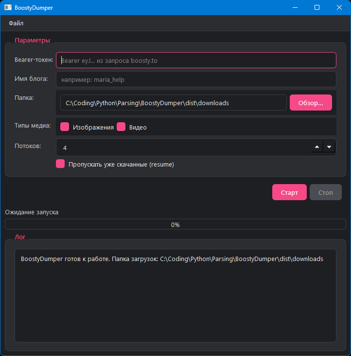

# BoostyDumper

> Загрузчик медиа (изображений и видео) с платформы **Boosty** — с графическим
> интерфейсом, параллельной загрузкой, корректной пагинацией и возобновлением.

Версия 2.0 — полностью переработанная архитектура с разделением на слои,
обработкой ошибок и сборкой в один `.exe`.

---

## Возможности

- **Графический интерфейс** на PySide6 (тёмная тема, прогресс-бар, лог-панель).
- **CLI-режим** `--cli` — для запуска без графического окружения.
- **Параллельная загрузка** — настраиваемое число потоков (1–32).
- **Возобновление (resume)** — уже скачанные файлы пропускаются.
- **Корректная пагинация** постов — обходит **все** страницы блога, а не только
  первую (исправление поведения исходной версии).
- **Повторные попытки** при временных сбоях сети/сервера (5xx, таймауты).
- **Уважение к rate limit** (HTTP 429) с паузой.
- **Безопасное хранение токена** — в локальном `config.json`, а не в исходниках.
- **Логирование в файл** с ротацией (`downloads/.logs/`).
- Одна ошибка одного файла **не роняет** весь процесс.

---

## Скриншот



---

## Установка из исходников

Требуется **Python 3.11+** (проверено на 3.12).

```bash
# 1. Клонировать репозиторий
git clone https://github.com/MoLineTy19/Boosty-Dumper
cd Boosty-Dumper

# 2. Виртуальное окружение
python -m venv .venv
#   Windows:  .venv\Scripts\activate
#   Linux:    source .venv/bin/activate

# 3. Зависимости
pip install -r requirements.txt

# 4. Запуск (GUI)
python run.py
```

---

## Сборка в один `.exe`

```bash
pip install -r requirements.txt
pip install -r requirements-build.txt

# Удобный скрипт (очищает build/dist и собирает):
build.bat

# Или вручную:
pyinstaller boosty_dumper.spec --noconfirm
```

Готовый файл появится в **`dist/BoostyDumper.exe`** — это один
самодостаточный исполняемый файл с графическим интерфейсом (~**31 МБ**).

Размер удалось сильно уменьшить за счёт того, что из PySide6 вырезаются
неиспользуемые модули (WebEngine = встроенный Chromium, QML, Quick3D,
Multimedia, SQL, 3D и т. п.) — приложение использует только
`QtCore`/`QtGui`/`QtWidgets`. Всё это настроено в `boosty_dumper.spec`.

**Ещё меньше (≈ ×1.5)** — положите переносимый `upx.exe` в папку `tools/`
(например, с [страницы релизов UPX](https://github.com/upx/upx/releases)) и
пересоберите: spec автоматически включит сжатие бинарников.

> Хотите иконку? Положите `icon.ico` рядом с `boosty_dumper.spec` и замените
> `icon=None` на `icon='icon.ico'`.

---

## Как получить Bearer-токен

Токен нужен, чтобы API отдавал контент, доступный вашей подписке.

1. Зайдите на [boosty.to](https://boosty.to/) и войдите в аккаунт.
2. Откройте страницу любого автора, нажмите **F12** → вкладка **Network**.
3. Поставьте фильтр **Fetch/XHR** и перезагрузите страницу.
4. В поиске запросов введите `media_album/?type`.
5. В заголовках этого запроса найдите `Authorization: Bearer <ТОКЕН>` —
   скопируйте сам токен (без `Bearer `).
6. Вставьте его в поле **Bearer-токен** в окне BoostyDumper (или в
   `config.json`).

Токен сохраняется локально в `config.json` рядом с `.exe`. **Не публикуйте его.**

---

## Использование

### GUI

1. Вставьте Bearer-токен.
2. Укажите имя блога (например `xcharodeykax`).
3. Выберите папку и типы медиа, задайте число потоков.
4. Нажмите **Старт**. Прогресс и лог видны в окне.
5. Чтобы прервать — **Стоп** (текущие файлы доделаются, новые не начнутся).

### CLI

```bash
python run.py --cli -b xcharodeykax --token ВАШ_ТОКЕН --workers 8
```

Поддерживаемые флаги:

| Флаг            | Описание                                              |
|-----------------|-------------------------------------------------------|
| `--cli`         | консольный режим (без GUI)                            |
| `-b, --blog`    | имя блога (обязательно для `--cli`)                   |
| `--token`       | Bearer-токен (перекрывает `config.json`)              |
| `--workers N`   | число потоков загрузки                                |
| `--no-images`   | не скачивать изображения                              |
| `--no-videos`   | не скачивать видео                                    |
| `--no-resume`   | перекачивать даже уже существующие файлы              |
| `-c, --config`  | путь к `config.json`                                  |
| `--version`     | показать версию                                       |

---

## Конфигурация

Настройки хранятся в `config.json` рядом с приложением (создаётся
автоматически при первом сохранении из GUI). Пример — `config.json.example`:

```json
{
  "token": "ВАШ_BEARER_ТОКЕН",
  "output_dir": "downloads",
  "max_workers": 4,
  "download_images": true,
  "download_videos": true,
  "skip_existing": true,
  "request_timeout": 30.0
}
```

> `config.json` и папка `downloads/` добавлены в `.gitignore` — они не попадают
> в репозиторий.

---

## Структура проекта

```
BoostyDumper/
├── boosty_dumper/              # основной пакет
│   ├── __init__.py
│   ├── __main__.py             # точка входа (GUI/CLI)
│   ├── config.py               # AppConfig — настройки + (де)сериализация
│   ├── exceptions.py           # иерархия исключений
│   ├── models.py               # dataclasses: MediaCounters, MediaItem, Post
│   ├── api.py                  # BoostyClient — сессия, retry, пагинация
│   ├── downloader.py           # DownloadService — потоки, resume, прогресс
│   ├── logging_setup.py        # ротация логов + GUI-обработчик
│   └── gui/
│       ├── main_window.py      # QMainWindow — форма, прогресс, лог
│       ├── workers.py          # QThread-воркер (сигналы progress/log/error)
│       └── style.qss           # тёмная тема
├── downloads/                  # куда качаются медиа (.gitignore'd)
│   └── <блог>/{images,videos}/
├── run.py                      # тонкая точка входа для запуска из исходников
├── config.json.example
├── requirements.txt            # runtime
├── requirements-build.txt      # pyinstaller
├── boosty_dumper.spec          # спецификация сборки
├── build.bat                   # скрипт сборки .exe
├── .gitignore
└── README.md
```

### Архитектура

Пакет разделён на слои с одним направлением зависимостей
(`gui → downloader → api → models/exceptions`):

- **`api.py`** — только сеть и типизация ответов; ничего не знает про файлы и UI.
- **`downloader.py`** — координация загрузки; общается с GUI/CLI через
  *callbacks*, а не через Qt-сигналы (отвязан от конкретного UI).
- **`gui/`** — Presentation-слой: `QThread`-воркер транслирует колбэки в
  Qt-сигналы, главное окно лишь подписывается на них.

### Что исправлено по сравнению с исходной версией

| Было (v1)                                            | Стало (v2)                                       |
|------------------------------------------------------|--------------------------------------------------|
| `main.py` не запускался (оборванный `print(`)        | —                                                |
| Картинка писалась дважды в файл                      | единая потоковая запись через `stream=True`      |
| `url['low'] == 'low'` — баг выбора качества         | корректный выбор по `type: high/medium/low`      |
| Bearer-токен зашит в `cookies.py`                    | вводится в UI, хранится в `config.json`          |
| Одна страница постов                                 | постраничная пагинация всех постов               |
| `exit()` при 401                                     | типизированное исключение + сообщение в UI       |
| Последовательная загрузка                            | `ThreadPoolExecutor`, до 32 потоков              |
| Нет resume                                           | пропуск существующих файлов                      |
| Только `input()`                                     | GUI + CLI                                        |

---

## Ресурсы

- **Python 3.11+** (проверено на 3.12)
- **PySide6** для GUI
- Любой современный браузер — для получения токена

---

## Отказ от ответственности

Проект предназначен для **личного** сохранения контента, на который у вас есть
доступ (оплаченная подписка). Уважайте условия пользования Boosty и авторские
права: не перераспространяйте скачанные материалы. Использование инструмента
вопреки правилам платформы — на вашей ответственности.

---

## Лицензия

MIT © MoLineTy19
